<div align="center">

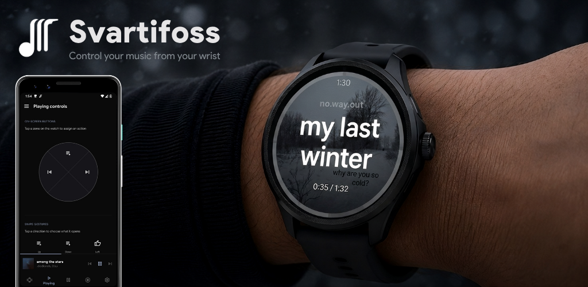

<br><br>

[](#)
[%20%2F%2026%20(watch)-informational)](#)
[](COPYING)
[](https://github.com/gabrielluizone/Svartifoss/releases)
[](https://github.com/gabrielluizone/Svartifoss/releases/latest)
[](https://github.com/gabrielluizone/Svartifoss/commits)


**Control the music playing on your phone from a Wear OS watch** — physical
buttons, screen gestures, the digital crown, a quick-actions panel, a Tile,
and a watch-face complication.

</div>

Svartifoss reads whatever media session is currently active on the phone (any
app that exposes one) and mirrors it to the watch: title, artist, album art,
playback position, queue, and transport controls. It is a rename and
continuation of [Music Center for Wear](https://github.com/matejdro/WearMusicCenter)
by matejdro — same lineage, new name, and a full Wear OS modernization since
the fork.

<p align="center">
  
  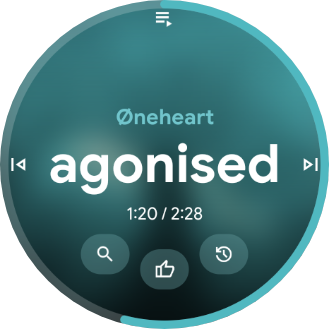
  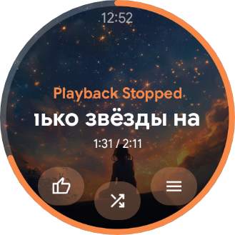
</p>

## Contents

- [What it can do](#what-it-can-do)
- [Installing](#installing)
- [Building](#building)
- [Support](#support)
- [Credits](#credits)

## What it can do

### On the watch

| | |
|---|---|
| **Now-playing screen** | Album art, an optional edge progress ring that can be made draggable on every layout, and optional rotary-crown seek. Song title and artist can each be hidden independently; when the title is shown, its sizing behavior is configurable. |
| **Configurable input** | Assign any supported action — play/pause, skip, volume, shuffle, repeat (including repeat-one), like/favorite, search, playlist shortcuts, Tasker tasks, opening another app — to physical buttons, screen quadrants (tap zones), or swipe gestures (up/down/left). |
| **Quick actions panel** | A secondary panel (double-tap to open) that can use four manually configured shortcuts or mirror the current media notification's real actions and icons. |
| **Queue and play history** | Browse the app's real playback queue when one is exposed, or fall back to a locally tracked play-history list when it isn't (common on apps that don't publish a skippable queue). |
| **Full action menu** | A full-screen list for anything not bound to a button or gesture. |
| **Search** | Trigger a voice or keyboard search against the currently playing app's media library directly from the watch, with a history of past searches you can replay or delete. |
| **Playlist shortcuts** | Name and save deep links to specific playlists (with an optional "start shuffled" flag), managed from the phone and reachable from the watch as a list or bound straight to a button. |
| **Glanceable surfaces** | A Tile with track info, previous/play-pause/next and ±10-second seek controls, plus a watch-face complication showing the current album art / title. |

<p align="center">
  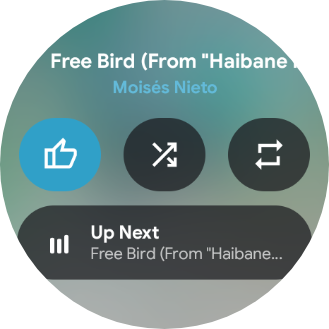
  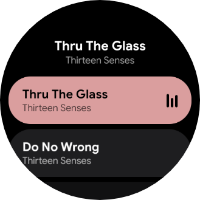
  
</p>
<p align="center"><em>Quick-actions panel&nbsp;·&nbsp;queue&nbsp;·&nbsp;actions menu &amp; playlist shortcuts</em></p>

### Look and feel

- Multiple screen themes (default, minimal, compact, cinema) and album-art
  display styles (full cover, blurred, black-and-white, blurred B&W, or
  hidden), with adjustable blur radius, dim strength, and ambient-mode
  opacity.
- Accent color can follow the current album art or be fixed to a custom
  color. The artist text and the progress bar each have their own independent
  color source (neutral, album, or custom, with an optional desaturate
  option), on top of the mini-buttons row and quick panel/menu accent.
- Per-surface layout options for the mini-buttons row and quick panel: multiple curve styles (flat up to extreme curvature), custom shapes (pill, wide, square, rounded rect, squircle, leaf, drop, and circle), background styles (glass, glass white, translucent album, solid, transparent), and color source.
- Customizable seek and volume readout overlay styles: glass pill, glass white, expressive, material, white, giant, split (position/total), translucent album, glow, outline, and solid.

<p align="center">
  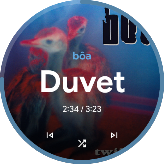
  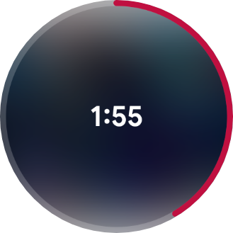
  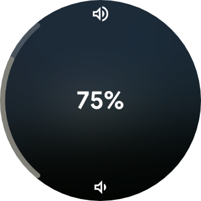
</p>
<p align="center"><em>Minimal theme&nbsp;·&nbsp;rotary-crown seek&nbsp;·&nbsp;volume overlay</em></p>

### On the phone

- Central place to configure every button, gesture, and screen on the watch,
  plus watch-facing preferences (themes, colors, timeouts, rotary behavior).
- A **Watch** tab with a live miniature that previews exactly how the
  now-playing screen will look — mirroring the track currently playing on the
  phone — as you tweak the appearance.
- Custom icon picker and color picker for personalizing actions.
- An **Apps** settings section for service-specific integrations, starting with
  YouTube Music playlist shortcuts and ready for more streaming services.
- A short in-app guide covering how to use Svartifoss on the watch.
- **Built-in updates**: a notification when a new release is out (with an
  optional pre-release channel), and one-tap watch updates — the phone
  downloads the new watch APK and sends it over Bluetooth, so you confirm
  the install on the wrist instead of re-running ADB or Wear Installer.

<p align="center">
  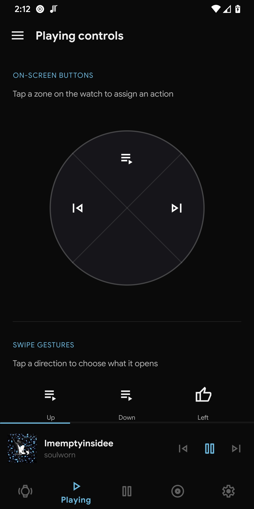
  
  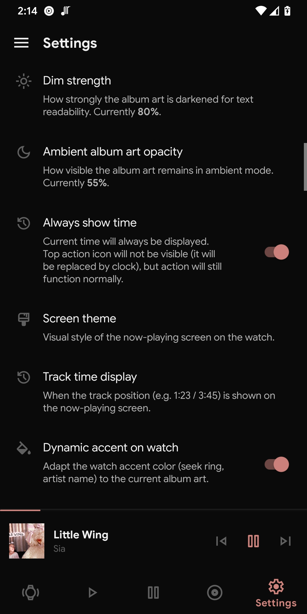
  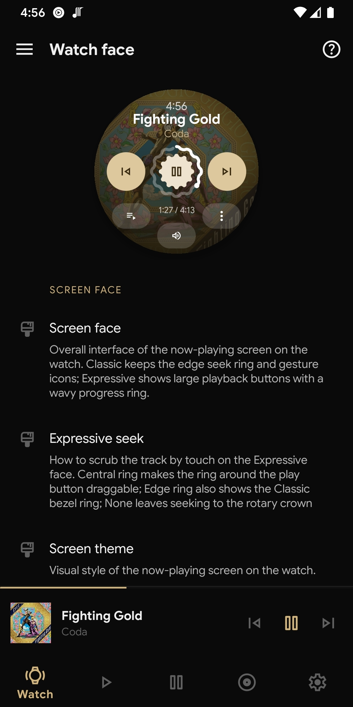
  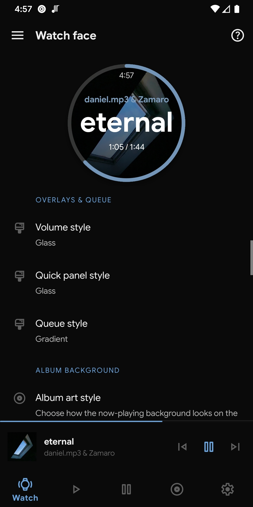
</p>
<p align="center"><em>Per-zone / gesture / button config&nbsp;·&nbsp;action picker&nbsp;·&nbsp;settings&nbsp;·&nbsp;Watch tab live preview&nbsp;·&nbsp;overlay &amp; queue styles</em></p>

### Under the hood

- All phone ⟷ watch communication happens over the local Wearable Data Layer
  connection — no account or app server is involved. The internet is touched
  only by the optional update check (a small anonymous request to the GitHub
  API, off-switch in Settings) and by Firebase diagnostics that help
  development. Crash reporting is enabled by default and can be disabled at
  any time under Settings → Data & support → Privacy.
- Works with any app that publishes a standard Android media session; extra
  features like like/shuffle/repeat and search rely on optional media-session
  extensions some apps expose (availability varies by app).

## Installing

The app is not on the Play Store, due to Google's constant annoying policies
and takedowns without a way to get a good explanation.

You can install it by manually sideloading the APK from the [releases page](https://github.com/gabrielluizone/Svartifoss/releases)
to your phone and to your watch. To make the watch install easier, you can use
[Wear Installer](https://www.xda-developers.com/wear-installer-sideload-wear-os-apps/).

That manual route is only needed for the **first** install (or when jumping
from a version older than 2.2): after that, the phone app notifies you about
new releases and can send the watch update over Bluetooth by itself — see
Settings → Updates.

## Building

Android Studio is convenient but not required — the project builds from the
command line via the Gradle wrapper.

### Prerequisites

- JDK 21
- Android SDK (either through [Android Studio](https://developer.android.com/studio)
  or the standalone [command-line tools](https://developer.android.com/studio#command-line-tools-only))
- `sdk.dir` pointing at that SDK in a `local.properties` file at the repo root
  (Android Studio creates this automatically on first sync)

### Build process

1. Pull the repo.
2. Pull the submodules: `git submodule update --init`
3. Build from the command line:

   ```sh
   ./gradlew assembleDebug
   ```

   or open the project in Android Studio and let it sync.

## Support

Svartifoss is free and open source, and stays that way either way — nothing
in the app is gated behind this. If it's useful to you and you'd like to help
out, you can do so on [Buy Me a Coffee](https://buymeacoffee.com/gabrielsvafoss)
or [Ko-fi](https://ko-fi.com/gabrielsvafoss).

## Credits

Svartifoss is a fork of [Music Center for Wear](https://github.com/matejdro/WearMusicCenter)
by matejdro, distributed under the [GPL-3.0](COPYING) license.
