<div align="center">

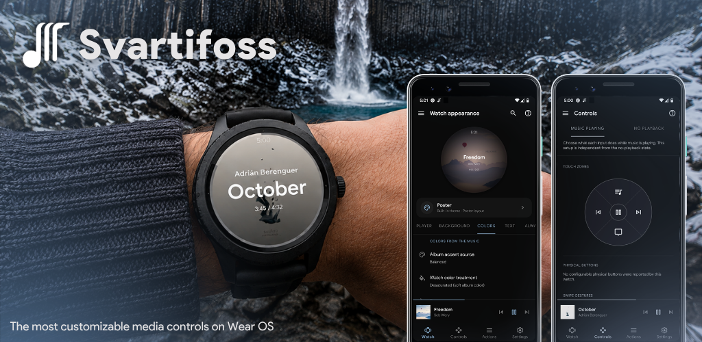

<br><br>

[](#)
[%20%2F%2026%20(watch)-informational)](#)
[](COPYING)
[](https://github.com/gabrielluizone/Svartifoss/releases)
[](https://github.com/gabrielluizone/Svartifoss/releases/latest)
[](https://github.com/gabrielluizone/Svartifoss/commits)


**Control the music playing on your phone from a Wear OS watch** — physical
buttons, screen gestures, the digital crown, a quick-actions panel, a Tile,
and a watch-face complication.

</div>

Svartifoss reads whatever media session is currently active on the phone (any
app that exposes one) and mirrors it to the watch: title, artist, album art,
playback position, queue, and transport controls. It is a rename and
continuation of [Music Center for Wear](https://github.com/matejdro/WearMusicCenter)
by matejdro — same lineage, new name, and a full Wear OS modernization since
the fork.

<p align="center">
  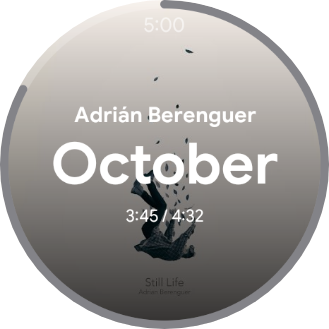
  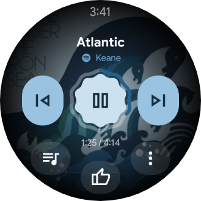
  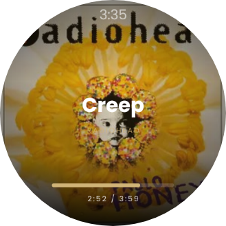
</p>
<p align="center"><em>Same watch, three of the twenty-two built-in faces &mdash; each one built from whatever's playing</em></p>

## Contents

- [What it can do](#what-it-can-do)
- [Installing](#installing)
- [Building](#building)
- [Support](#support)
- [Credits](#credits)

## What it can do

### On the watch

| | |
|---|---|
| **Twenty-two now-playing faces** | Classic, MatejDro (a tribute to the original WearMusicCenter this app forked from), Expressive, and a curated collection (Poster, Studio, Vinyl, Halo, Aurora, Eclipse, Spectrum, Material, Depth, Carousel, Chat, Split, Note, the lyric-following Verse, the detail-listing Metadata, the performer-forward Artist, the Spotify-style Immersive layout, the queue-art Ribbon and the framed Frame) — each one builds its gradients, accents and progress treatment from the album art actually playing. An optional edge progress ring can be made draggable on every layout, with optional rotary-crown seek. Title and artist can each be hidden independently, with configurable sizing/marquee behavior. |
| **Configurable input** | Assign any supported action — play/pause, skip, volume, shuffle, repeat (including repeat-one), like/favorite, search, playlist shortcuts, Tasker tasks, opening another app — to physical buttons, screen quadrants (tap zones), swipe gestures (up/down/left), or the now-configurable center tap. |
| **Quick actions panel** | Four distinct layouts — Arc, Hero, Grid, and Labelled rows — each in a choice of styles, from full glass containers down to a bare accent marker. Slots can be manually assigned or mirror the current media notification's real actions and icons. |
| **Queue and play history** | Browse the app's real playback queue when one is exposed, or fall back to a locally tracked play-history list when it isn't. A dozen+ visual styles, including cover-art rows that mirror each entry's own artwork. |
| **Full action menu** | A full-screen list for anything not bound to a button or gesture. |
| **Search** | Trigger a voice or keyboard search against the currently playing app's media library directly from the watch, with a history of past searches you can replay or delete. |
| **Playlist shortcuts that actually play** | Save links from YouTube Music, Spotify, Deezer, TIDAL, Apple Music, Amazon Music, SoundCloud, Qobuz, Bandcamp, Audiomack, Mixcloud or Pandora. The watch first tries an active session and the app's background media browser; when a service declines those contracts, it falls back to visibly opening the link. A second Tile lists the shortcuts as tappable chips. |
| **Glanceable surfaces** | A media Tile (track info, transport, ±10s seek) that follows the album's accent color, a Shortcuts Tile for one-tap playlist access, and a watch-face complication showing the current album art / title. |

<p align="center">
  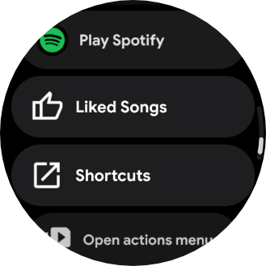
  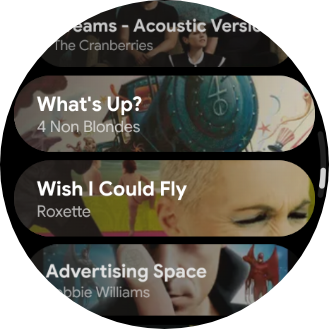
  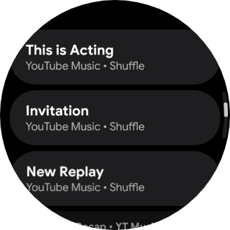
</p>
<p align="center"><em>Quick-actions panel&nbsp;·&nbsp;queue&nbsp;·&nbsp;actions menu &amp; playlist shortcuts</em></p>

### Look and feel

- **Save your own look as a named theme.** Pick a base face, then combine its
  typography, colors, artwork treatment, dim/shading, always-on display,
  progress, panels and mini-buttons in one live editor. Apply, duplicate,
  rename or delete profiles — each stays independent, so editing one never
  touches the others.
- Multiple screen themes (default, minimal, compact, cinema, vivid, contrast,
  AMOLED, hidden) and a dozen+ album-art styles: full cover, blurred,
  black-and-white, **Square** (uncropped, three corner styles), and gradient
  treatments like Corona, Dusk, Bloom, Horizon and Ember — each with
  adjustable blur radius, dim strength, and ambient-mode opacity.
- **Color treatment pickers show what they'll actually look like**: each
  option (Normal, Desaturated, Expressive) renders live swatches computed
  from the current album art, instead of a blind text list. Artist text, the
  progress bar, volume, seek and the quick panel can each follow the watch
  treatment or override it independently.
- Per-surface layout options for the mini-buttons row and quick panel:
  multiple curve styles, custom shapes (pill, wide, square, rounded rect,
  squircle, leaf, drop, circle), background styles, and color source.
- A dozen+ seek and volume readout styles (glass pill, expressive, material,
  giant, position/total, terminal, mono, hairline, and more), plus volume
  layouts that can sit on any edge of the bezel or wrap it as a full ring.
- 138 typefaces for track text, including Inter, Source Sans 3, IBM Plex,
  Noto, Cormorant, Recursive and more; title, artist, lyrics, clock and track
  time can each use their own choice.

<p align="center">
  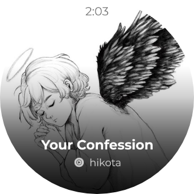
  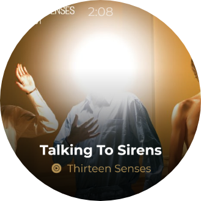
  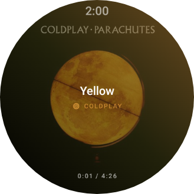
</p>
<p align="center"><em>Studio&nbsp;·&nbsp;Halo&nbsp;·&nbsp;Eclipse — three of the curated collection</em></p>

### On the phone

- Central place to configure every button, gesture, and screen on the watch,
  plus watch-facing preferences (themes, colors, timeouts, rotary behavior).
- A **Watch** tab with a live miniature that previews exactly how the
  now-playing screen will look — mirroring the track currently playing on the
  phone — as you tweak the appearance, including your saved custom themes.
- **Community themes**: an opt-in public gallery of looks. Search by theme or
  author, filter by base layout, and order the downloaded public catalogue by
  newest or most liked — all on the phone, with no account. Gallery cards stay
  synthetic, using the theme profile and built-in sample media. Tapping a card
  opens details before installation, including local Player, always-on, Volume,
  Progress, Quick panel, and Queue renders. Their text, timing, and queue remain
  synthetic, while the detail preview can show the current album cover only from
  memory on your phone; that cover is never uploaded, transmitted, captured as a
  screenshot, or paired with your title, artist, or playback data. A theme is
  added to your library only when you then tap **Add and apply**. Likes are one
  private reaction per Firebase Auth account for each published theme: an
  explicit heart tap asks for Google Sign-In only when needed, voter identities
  cannot be listed, and the trusted publisher eventually writes aggregate counts
  into the static catalogue.
  The explicit **Liked** filter reads only your own reaction documents for IDs
  already public in that catalogue; it never lists voters. You can explicitly
  submit a user-owned local theme for review; the public entry uses its chosen
  name and either a pseudonym or Anonymous rather than Google account information. The local preflight
  requires 12 applicable visual changes and the rules allow up to three
  submissions in a rolling 24-hour window. Theme updates are not implemented
  yet. See the [privacy policy](docs/privacy-policy.md).
- Custom icon picker and color picker for personalizing actions.
- A redesigned **Streaming shortcuts** screen: live link inspection,
  share/clipboard input, drag reordering, Open now / Copy link / Undo after
  deletion, and recognized links across twelve services. The action picker also
  includes the account-wide Deezer Flow route alongside the existing YouTube
  Music, Spotify and SoundCloud library shortcuts. An optional,
  off-by-default toggle fetches a shortcut's real cover art once when its
  service exposes public preview data.
- **45 languages**: English, Brazilian and European Portuguese, German,
  Spanish, Italian, Dutch, Russian, Greek, Romanian, Indonesian, Persian,
  Simplified and Traditional Chinese, Icelandic, French, Turkish, Vietnamese,
  Czech, Swedish, Norwegian, Hungarian, Arabic, Hindi, Filipino, Kazakh,
  Japanese, Korean, Polish, Ukrainian, Thai, Hebrew, Danish, Finnish, Slovak,
  Bulgarian, Serbian, Croatian, Malay, Bengali, Burmese, Tamil, Telugu,
  Marathi and Central Kurdish — covering both apps and their shared strings.
- A short in-app guide covering how to use Svartifoss on the watch.
- **Built-in updates**: a notification when a new release is out (with an
  optional pre-release channel), and one-tap watch updates — the phone
  downloads the new watch APK and sends it over Bluetooth, so you confirm
  the install on the wrist instead of re-running ADB or Wear Installer.

<p align="center">
  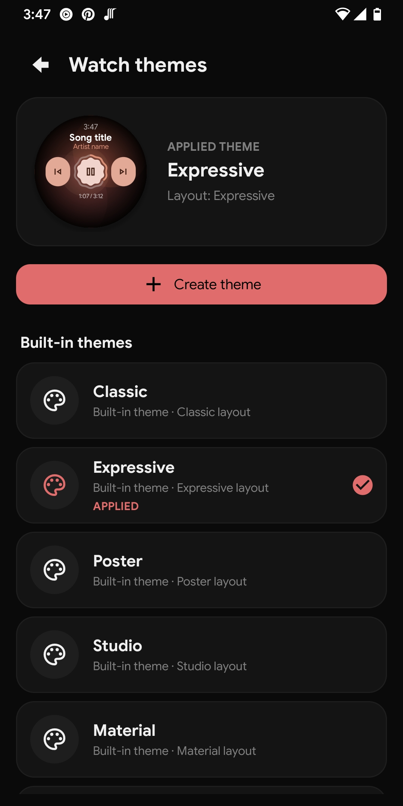
  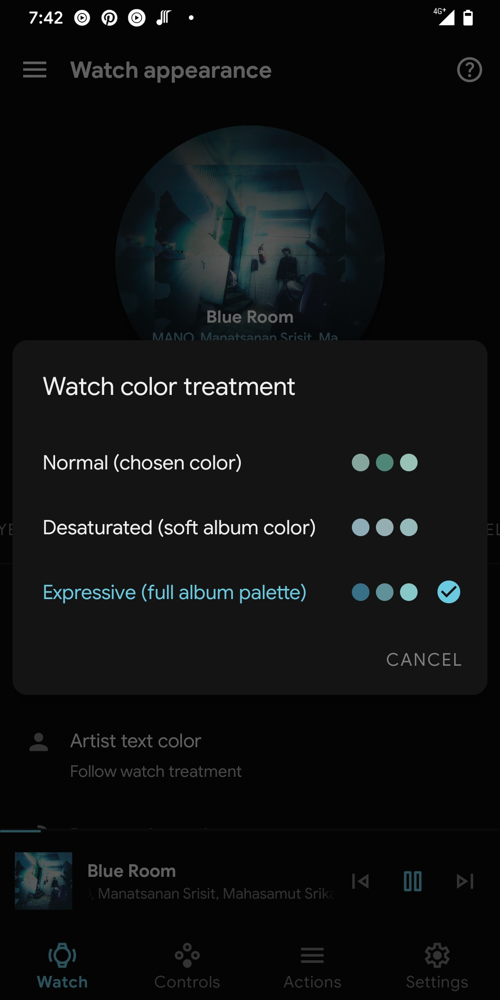
  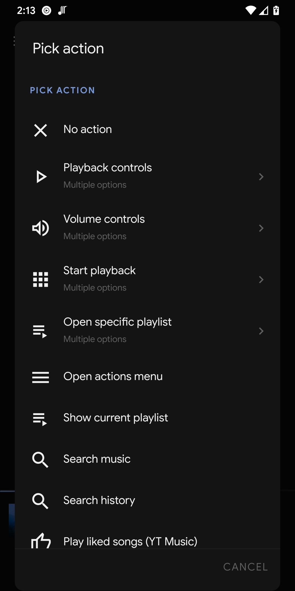
  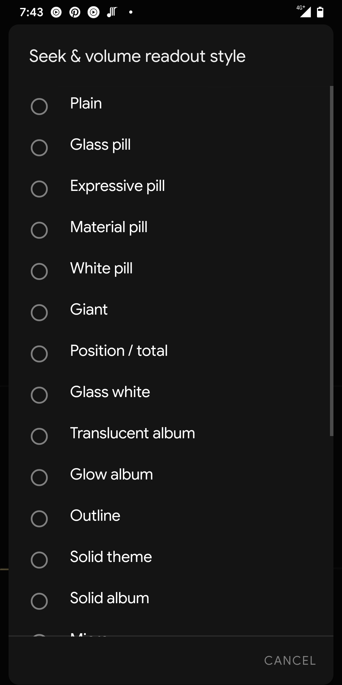
  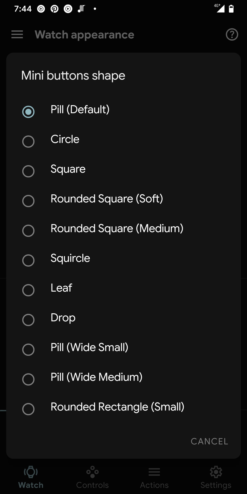
</p>
<p align="center"><em>Watch themes manager&nbsp;·&nbsp;color treatment swatches&nbsp;·&nbsp;action picker&nbsp;·&nbsp;seek/volume styles&nbsp;·&nbsp;mini-button shapes</em></p>

### Under the hood

- All phone ⟷ watch communication happens over the local Wearable Data Layer
  connection — no account is needed for it or for the community gallery. The
  internet is touched by the optional update check (a small anonymous request
  to the GitHub API), by the community-theme catalogue only when you explicitly
  open that gallery, and by Google Firebase Authentication/Firestore only when
  you explicitly submit a theme for review or tap Like on a published theme. It
  is also used by Firebase
  diagnostics that help development, occasional developer announcement
  notifications sent via Firebase Cloud Messaging (topic-based), and — only if
  you opt in — the shortcut-artwork fetch, which goes straight to the streaming
  service itself. Crash reporting, announcement notifications and shortcut
  artwork are each independently toggleable under Settings → Data & support →
  Privacy or Apps.
- Works with any app that publishes a standard Android media session; extra
  features like like/shuffle/repeat and search rely on optional media-session
  extensions some apps expose (availability varies by app).

## Installing

The app is not on the Play Store, due to Google's constant annoying policies
and takedowns without a way to get a good explanation.

You can install it by manually sideloading the APK from the [releases page](https://github.com/gabrielluizone/Svartifoss/releases)
to your phone and to your watch. To make the watch install easier, you can use
[Wear Installer](https://www.xda-developers.com/wear-installer-sideload-wear-os-apps/).

That manual route is only needed for the **first** install (or when jumping
from a version older than 2.2): after that, the phone app notifies you about
new releases and can send the watch update over Bluetooth by itself — see
Settings → Updates.

## Building

Android Studio is convenient but not required — the project builds from the
command line via the Gradle wrapper.

### Prerequisites

- JDK 21
- Android SDK (either through [Android Studio](https://developer.android.com/studio)
  or the standalone [command-line tools](https://developer.android.com/studio#command-line-tools-only))
- `sdk.dir` pointing at that SDK in a `local.properties` file at the repo root
  (Android Studio creates this automatically on first sync)

### Build process

1. Pull the repo.
2. Pull the submodules: `git submodule update --init`
3. Build from the command line:

   ```sh
   ./gradlew assembleDebug
   ```

   or open the project in Android Studio and let it sync.

## Support

Svartifoss is free/libre and open source (GPLv3), and stays that way — the
source is here for anyone to build and run at no cost, and no feature is gated
behind a payment. If it's useful to you and you'd like to help out, you can do
so on [Buy Me a Coffee](https://buymeacoffee.com/gabrielsvafoss) or
[Ko-fi](https://ko-fi.com/gabrielsvafoss).

## License

Svartifoss is licensed under the [GNU General Public License v3](COPYING).
"Free" means freedom, not price: a price on a store listing pays only for a
pre-built, auto-updating binary and restricts none of the rights the GPLv3
grants. The app links some proprietary Google libraries (the Wearable Data
Layer API, Firebase); how that is handled under the GPLv3 is set out in
[LICENSING.md](LICENSING.md).

## Credits

Svartifoss is a fork of [Music Center for Wear](https://github.com/matejdro/WearMusicCenter)
by matejdro, distributed under the [GPL-3.0](COPYING) license.
