<h1>Svartifoss</h1>

  <a href="docs/images/Svartifoss-4-Poster.png">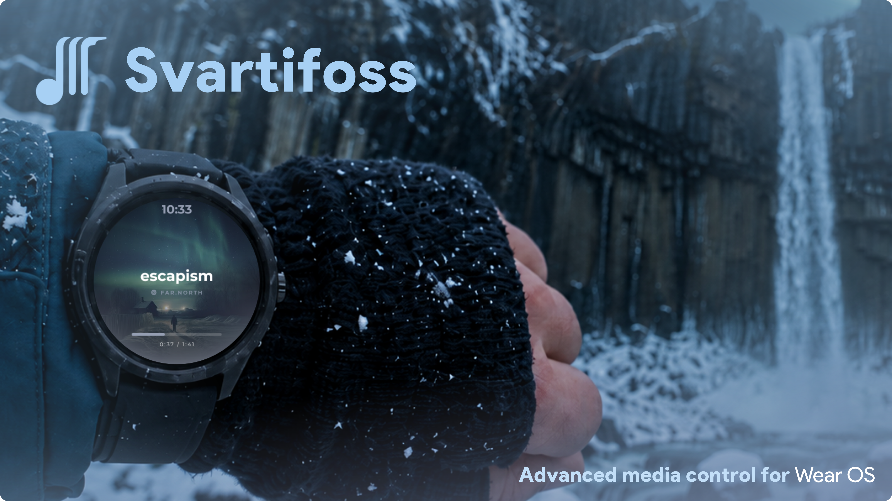</a>

Svartifoss connects the media app on your Android phone to your paired Wear OS watch. Music, podcasts and audiobooks appear on your wrist with their artwork, track information, playback position and available controls. Configure everything from the phone, then use physical buttons, touch gestures, the crown or on-screen actions to control it.

Choose an artwork-focused player for the couch, large controls for a walk, or lyrics that follow the song. Save each look as a theme, preview changes on the phone and switch from the watch. Basic playback uses Android media sessions; search, queues and other extras depend on what your player exposes.

**Explore:** [Lyrics](#lyrics-that-follow-the-song) · [Faces and appearance](#make-the-watch-your-own) · [Controls and queues](#what-it-can-do) · [Track details](#look-beyond-the-track-title) · [Shortcuts and Tiles](#keep-favorite-music-one-tap-away) · [Live editor](#design-it-on-your-phone) · [Community themes](#community-themes) · [Compatibility and privacy](#compatibility-and-privacy) · [Installing](#installing) · [Support](#support)

> [!IMPORTANT]
> Svartifoss is in closed Google Play testing before its public launch, and I am looking for testers. First [join the Google Group](https://groups.google.com/g/svartifoss-wearos) with the Google account you use on your phone; then [install Svartifoss from Google Play](https://play.google.com/store/apps/details?id=com.svartifoss.snfell&pcampaignid=web_share). The Google Play edition is free through **September 22, 2026**. If Google Play does not show the app immediately, allow a few minutes for the new group membership to sync.

Select any screenshot in this README to open it at full size.

## Lyrics that follow the song

Read along without reaching for your phone. Svartifoss offers two ways to follow lyrics: a **dedicated Lyrics reader** for exploring the song and **Verse**, a player layout that keeps the current passage beside your track information.

### A reader you can navigate

Open **Lyrics** from an assigned action or the action menu. The current line is highlighted, surrounding lines stay visible and a fine progress indicator follows the timing within the line. The reader automatically centers each new line as the song moves on.

Scroll with touch or the crown to browse the lyrics, then **tap a timed line to jump back to that verse or ahead to the chorus**, if your phone's player accepts seeking. Automatic following resumes on the next line change. When only untimed lyrics are available, the reader displays scrollable text without synchronized highlighting or line seeking.

### Verse: lyrics inside the player

Verse shows the previous, current and next lines together with the song information, clock and track position. It is the glanceable option for following a song while staying on the player; full-song browsing and tap-to-seek belong to the dedicated reader. When synchronized lyrics are unavailable, Verse falls back to a title card.

  <a href="docs/images/gallery-watch-verse-red.png">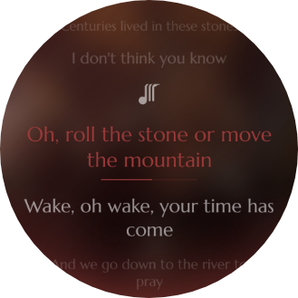</a>
  <a href="docs/images/gallery-watch-verse-underline.png">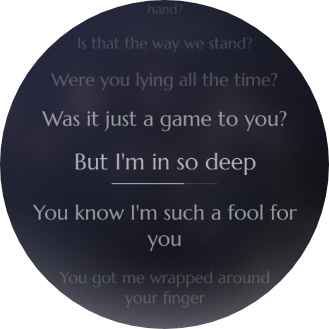</a>
  <a href="docs/images/gallery-watch-verse-eternally-missed.png">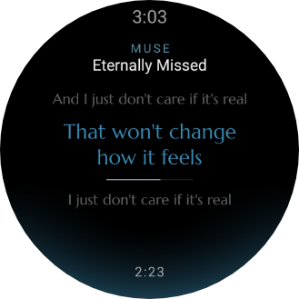</a>

<em>Lyrics reader · Current-line progress · Verse player layout</em>

Choose the lyrics typeface for both experiences, and customize the reader's accent color and backdrop from the phone. Lyrics are fetched on demand through **LRCLIB** when the reader or Verse needs them; a matching track and enabled online lookup are required, and not every song has timed lyrics.

## Make the watch your own

### Fifteen layouts, different ways to listen

These are player layouts inside Svartifoss. Choose prominent transport controls, an artwork-first screen, an album carousel, a performer portrait, synchronized lyrics or a detailed metadata view. Your everyday Wear OS watch face stays independent.

  <a href="docs/images/gallery-watch-poster-coffee.png">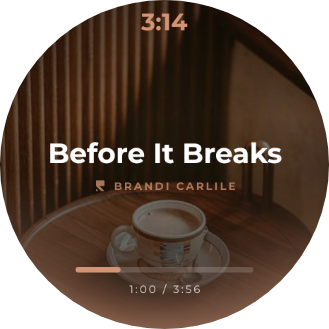</a>
  <a href="docs/images/face-expressive-muse.png">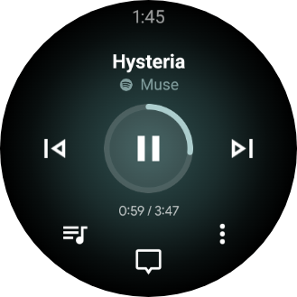</a>
  <a href="docs/images/face-artist-deer.png">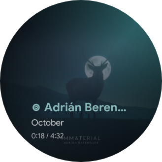</a>

<em>Poster · Expressive · Artist</em>

  <a href="docs/images/face-carousel-brandi.png">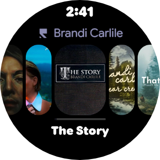</a>
  <a href="docs/images/face-frame-keane.png">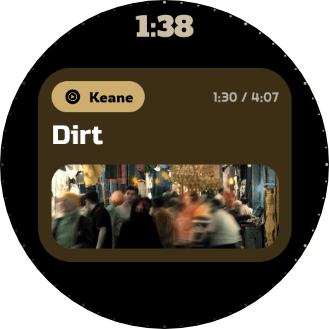</a>
  <a href="docs/images/face-metadata-betrayal.png">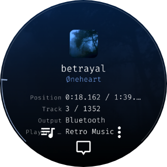</a>

<em>Carousel · Frame · Metadata</em>

Explore the 15 player layouts

Classic, Expressive, Poster, Studio, Material, Carousel, Chat, Split, Note, Verse, Metadata, Artist, Immersive, Ribbon and Frame.

Each layout is a starting point you can customize and save as your own theme.

### Same layout. Four different records.

Album artwork can drive the colors, gradients and progress accents across the player. Here is **Expressive** on four tracks, using captures from the site's comparison gallery.

  <a href="docs/images/compare-expressive-escapism.png">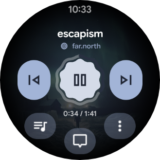</a>
  <a href="docs/images/compare-expressive-breaks.png">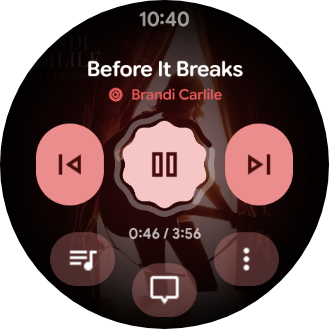</a>
  <a href="docs/images/compare-expressive-sirens.png">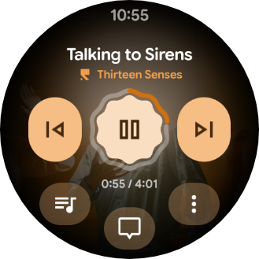</a>
  <a href="docs/images/compare-expressive-comatose.png">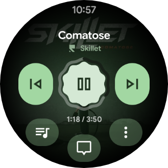</a>

<em>escapism · Before It Breaks · Talking to Sirens · Comatose</em>

[Compare 15 layouts across these four tracks on the website.](https://gabrielluizone.github.io/Svartifoss/#compare)

### Style every part of the player

Appearance settings cover the player, its controls and the screens opened from it.

| Layer                  | Your choices                                                                                                                                                                           |
| ---------------------- | -------------------------------------------------------------------------------------------------------------------------------------------------------------------------------------- |
| Artwork and background | Full covers, square artwork, blur, grayscale, gradients and layered backgrounds. Choose the media app's artwork, an online cover lookup or an artist picture.                          |
| Color                  | Live swatches for Normal, Desaturated, Expressive, Complementary, Triadic, Analogous, Monochrome and Duotone treatments, plus independent overrides for individual elements.           |
| Typography             | 140+ built-in font choices. Choose typefaces for title, artist, lyrics, clock and track time, with additional size, weight, visibility and readability controls where supported.       |
| Buttons and panels     | Shape the mini buttons and quick actions with curved arrangements, custom backgrounds and colors. The quick panel offers 14 layouts and 30 styles.                                     |
| Volume, seek and queue | Choose from 26 volume styles, 31 seek styles and 26 queue styles, including rings, arcs, ticks, glow and artwork rows. An optional draggable edge ring lets you seek around the bezel. |
| Always-on display      | Set the ambient presentation, artwork, dim level and visible elements separately from the interactive player.                                                                          |

  <a href="docs/images/mural-volume-gradient.png">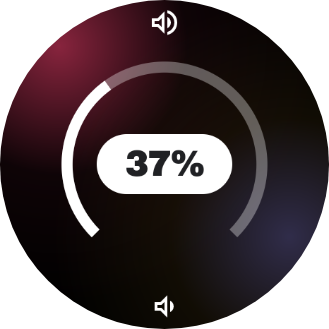</a>
  <a href="docs/images/mural-seek-ticks.png">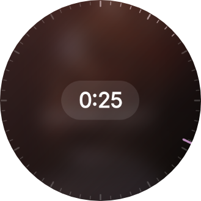</a>
  <a href="docs/images/watch-aod-chrono.png">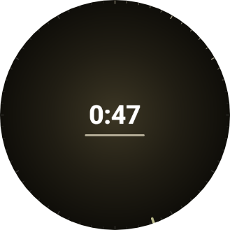</a>

<em>Volume · Seek · Always-on display</em>

## What it can do

### Control playback your way

Set up separate actions for **Music playing** and **No playback**. A button can skip a track while you listen and open a saved playlist when playback stops.

| Input                   | What you can configure                                                                         |
| ----------------------- | ---------------------------------------------------------------------------------------------- |
| Physical buttons        | Assign single, double and long presses on the buttons your watch supports.                     |
| Touch gestures          | Bind screen quadrants, swipes and the center tap to your preferred actions.                    |
| Crown or rotating bezel | Adjust volume or seek through a track, with configurable sensitivity.                          |
| Mini buttons            | Put three actions on the player, with separate tap and long-press assignments.                 |
| Quick-actions panel     | Choose each slot yourself or mirror the actions and icons from the current media notification. |
| Double pinch            | Trigger an assigned action on supported watches and software versions.                         |

The action catalogue includes play/pause, skip, restart, stop, volume, seeking, playback speed, shuffle, repeat, player-specific likes, search, queues, streaming shortcuts, app launchers and Tasker tasks. Availability follows the connected player's capabilities. The full action menu keeps additional commands within reach.

For **podcasts and audiobooks**, configure how many seconds to skip forward or back, or assign a playback-speed preset from **0.5× to 2×**. Replay a sentence or move through a familiar passage without taking out your phone, when the player supports these commands.

  
  <a href="docs/images/gallery-watch-quickpanel-thescientist.png">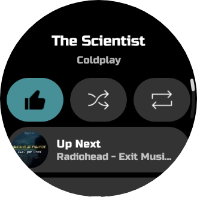</a>
  <a href="docs/images/gallery-watch-menu-streaming-b.png">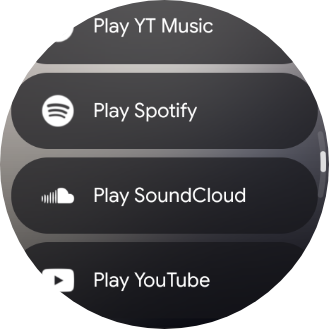</a>

<em>Mini buttons · Quick actions with Up Next · Streaming actions</em>

### Pick what plays next

Browse the player's **queue** as artwork-backed rows, load more entries and select a track to jump to it. If the player does not publish a queue, Svartifoss offers **locally tracked listening history** instead, so recently heard tracks remain discoverable. History records past listening; it is not a prediction of the player's upcoming queue.

An **Up Next** preview can show the upcoming track in the quick-actions panel and on the player when the mini-button area is free. Check what follows without opening the full queue.

Use **voice or keyboard search**, return to recent queries, or browse a media app's library directly from the watch. Browsing follows the folders and playable entries that the app exposes, rather than assuming every service has the same catalogue. Search, queue selection and replaying history depend on the player's supported interfaces.

### Look beyond the track title

The **Metadata** layout turns the player into a track-information view. Choose which groups to show; only available fields appear.

| Details                 | Examples                                                                                                         |
| ----------------------- | ---------------------------------------------------------------------------------------------------------------- |
| Recording and release   | Album, album artist, track/disc number, genre, year, release date, label and country.                            |
| Credits and identifiers | Composer, writer, author, ISRC and MusicBrainz identifiers.                                                      |
| Playback and source     | Playback speed, reported output information, source app, media origin and download status.                       |
| Audio and file          | Codec, bitrate, sample rate, channel count, filename and file size, when an accessible local file provides them. |

Information comes from the player and accessible local-file tags. Optional **MusicBrainz enrichment**, disabled by default, can add missing release details when a match is found. Technical fields are not guaranteed for streaming tracks, and output information is not a live route monitor.

  <a href="docs/images/mural-queue-coral.png">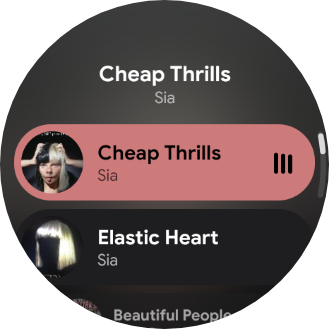</a>
  <a href="docs/images/watch-search-results.png">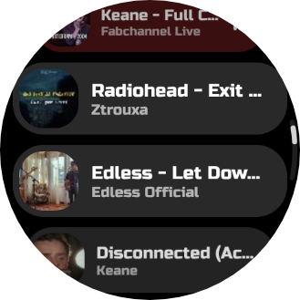</a>
  <a href="docs/images/compare-metadata-comatose.png">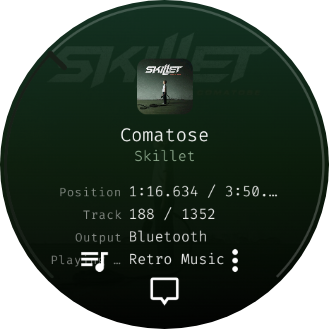</a>

<em>Playback queue · Search results · Metadata layout</em>

### Keep favorite music one tap away

Share or paste a streaming link on the phone to save a shortcut to a track, album, artist, playlist, show, episode or mix. Reorder shortcuts, inspect the destination and optionally fetch its cover art. The watch tries direct playback through the target app's supported interfaces; if that is unavailable, the phone opens the link visibly.

A saved link also becomes an **assignable action**: put a favorite playlist on a physical button, gesture or quick-panel slot. The action catalogue additionally includes service-specific destinations such as liked music on YouTube Music, Spotify and SoundCloud, and Deezer Flow, subject to service support.

Recognized services include **YouTube Music, Spotify, Deezer, TIDAL, Apple Music, Amazon Music, SoundCloud, Qobuz, Bandcamp, Audiomack, Mixcloud and Pandora**. A saved link does not guarantee that its service allows playback to start in the background.

### Reach music outside the player screen

| Surface                 | What you can do                                                                                 |
| ----------------------- | ----------------------------------------------------------------------------------------------- |
| Media Tile              | See the current track, use transport controls and seek ±10 seconds when the track supports it. |
| Shortcuts Tile          | Launch saved music shortcuts from your watch's Tile carousel.                                   |
| Watch-face complication | Put album art or track information on a compatible watch face and tap to open Svartifoss.       |
| Wear OS media controls  | Control the phone's playback through the watch's own media interface.                           |

These are additional ways to reach your **phone's playback**, not a standalone music library or streaming player on the watch.

### Make starting and resuming fit your routine

Optionally open Svartifoss on the watch when playback starts, and exclude phone apps that should not trigger it. Choose how long the watch app stays reachable after a pause so you can return to your music; longer hold times keep a background service running.

When nothing is playing, configure a button to **resume the last app**, open playlist shortcuts, search, show recently played tracks or open the action menu. You can also choose a destination to open automatically when you enter Svartifoss without playback.

## Design it on your phone

The **Watch** tab places a live preview above the appearance editor. Adjust the player, artwork, colors, text, controls or always-on display and see the result as you edit, using the current track or sample content. Watch-facing settings sync to the paired watch.

Save a look in **My themes**. Apply, duplicate, rename or delete profiles independently, and keep different appearances for different layouts. Combine typography, artwork treatments and color choices to make the result personal.

The **background layer editor** lets you compose a stack of up to eight layers: add, duplicate and reorder layers, then adjust their strength and supported colors. Combine backgrounds, shadows and accents while watching the preview change.

  <a href="docs/images/gallery-phone-player-tab-poster.jpg">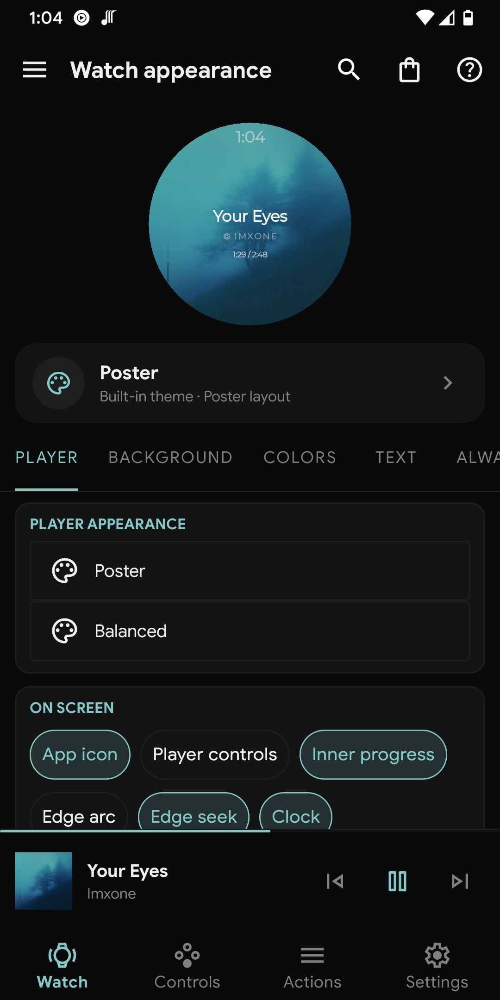</a>
  <a href="docs/images/phone-color-treatment2.jpg">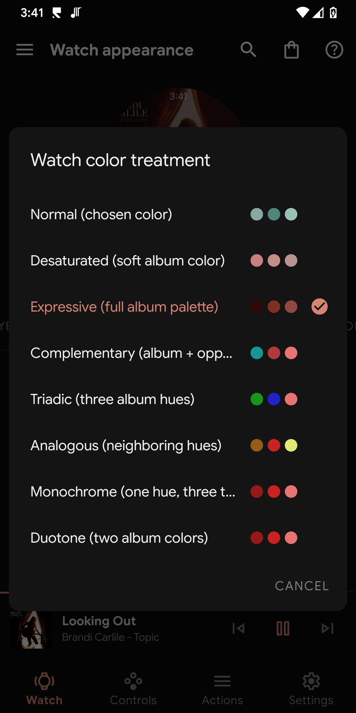</a>
  <a href="docs/images/phone-typeface-picker.jpg">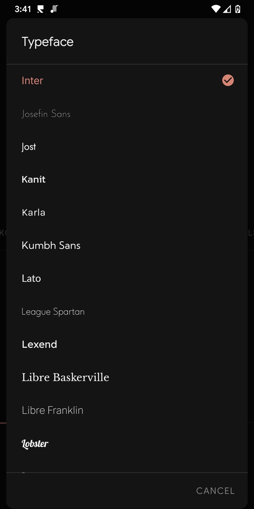</a>
  <a href="docs/images/gallery-phone-background-layers-haibane.jpg">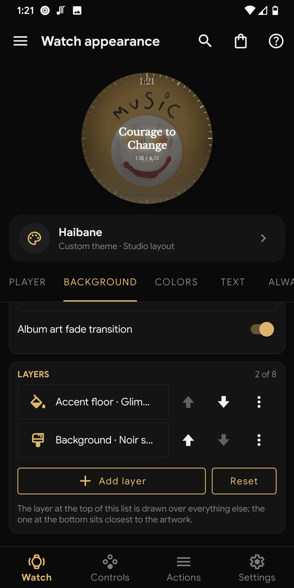</a>

<em>Live preview · Palette choices · Typography · Background layers</em>

### Keep your setup

**Selective configuration backups** cover more than appearance: export button mappings, action lists, settings, saved themes, streaming shortcuts, search and listening history, and the icons those configurations use. Choose which groups go into the backup; restoring applies those saved groups, so you can carry a personal setup to a reinstall without rebuilding it by hand.

Settings search and an in-app guide help you find the relevant controls. Both apps are localized in **45 languages**, including English, Brazilian and European Portuguese.

## Community themes

Browse looks made by other users, search by name or author, filter by base layout and sort by newest, likes or installs. Open a theme to inspect its Player, always-on, Volume, Progress, Quick panel and Queue previews, then **Add and apply** to create an editable copy in your library.

  <a href="docs/images/phone-community-gallery.jpg">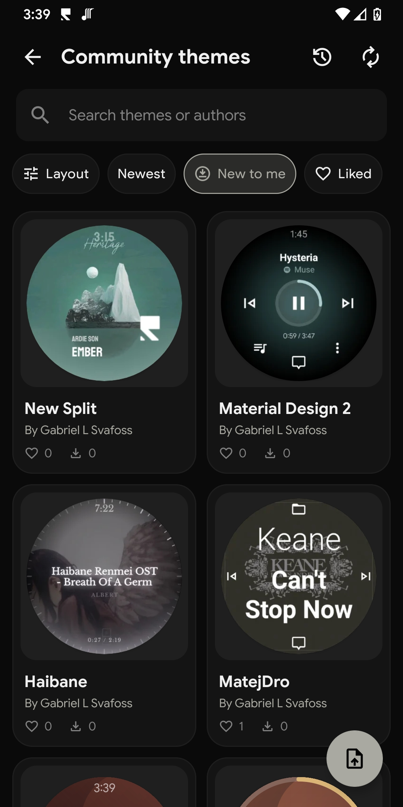</a>
  <a href="docs/images/phone-themes-library.jpg">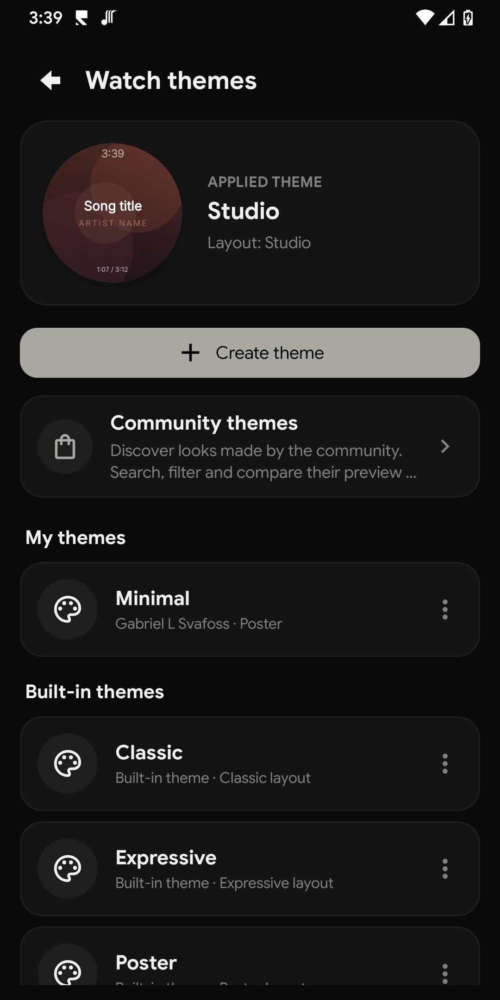</a>

<em>Find a community theme · Make it your own</em>

Browsing needs no account. Likes, installs and reports use an anonymous Firebase identity without asking for Google Sign-In. Sharing one of your own themes for moderation does require Google Sign-In; the public entry uses your chosen name and pseudonym or Anonymous label.

Gallery previews are rendered on the phone from theme data. Authors can optionally attach a watch screenshot they choose themselves; Svartifoss does not capture the watch's screen. See the [privacy policy](docs/privacy-policy.md) for the full details.

[See more real watch screenshots in the website gallery.](https://gabrielluizone.github.io/Svartifoss/#gallery)

## Compatibility and privacy

Svartifoss uses the media capabilities Android apps make available. The same watch controls can work with different players, while richer features vary:

| Feature                           | What it depends on                                                                                         |
| --------------------------------- | ---------------------------------------------------------------------------------------------------------- |
| Playback and track information    | An active Android media session with the relevant transport controls and metadata.                         |
| Queue and library                 | A published queue or browsable media library. Listening history is the queue fallback.                     |
| Search, likes, shuffle and repeat | The relevant media-session, notification or library action exposed by the player.                          |
| Lyrics                            | An available lyrics match and online lookup enabled.                                                       |
| Extra metadata                    | Player tags or accessible local-file details; optional online enrichment adds information where available. |
| Crown, bezel and double pinch     | Compatible watch hardware and software.                                                                    |

Playback control and configuration travel between your paired devices through the Wearable Data Layer. Core use does not require a Svartifoss account.

Online features include the community catalogue, lyrics, optional metadata and artwork lookups, GitHub update checks, and Firebase services for community interactions, diagnostics and announcements. Crash reporting and developer announcements are enabled by default and can be disabled in Settings. MusicBrainz enrichment and shortcut-cover fetching are off by default; lyrics lookup is enabled but requests a track only when a lyrics screen or Verse needs it.

The app asks for notification access to read and control the active media session. It does not use that permission to read your messages or emails. [Read the complete privacy policy.](docs/privacy-policy.md)

## Installing

You need an **Android phone running Android 6.0 / API 23 or newer** and a **paired Wear OS watch running Android 8.0 / API 26 or newer**.

### Google Play closed test

Svartifoss is not publicly released yet. To join the closed test:

<table>
  <tr>
    <td width="176" valign="middle">
      
    </td>
    <td valign="middle">
      <ol>
        <li><a href="https://groups.google.com/g/svartifoss-wearos">Join the Svartifoss Google Group</a> with the Google account you use on your phone.</li>
        <li>Then <a href="https://play.google.com/store/apps/details?id=com.svartifoss.snfell&pcampaignid=web_share">install Svartifoss from Google Play</a> on your phone and Wear OS watch.</li>
      </ol>
    </td>
  </tr>
</table>

Google Play can take a few minutes to recognize a new group membership. Updates for the test arrive through Google Play.

The Google Play edition is free through **September 22, 2026**.

### GitHub releases

Already using the GitHub edition? It will continue, and the next release will be published soon. Existing users can keep updating through their current distribution; find the latest available build on the [GitHub releases page](https://github.com/gabrielluizone/Svartifoss/releases/latest).

### First connection

1. Install and open Svartifoss on both devices.
2. Grant notification access on the phone when prompted.
3. Start playback in your media app and open Svartifoss on the watch.
4. Use the phone's Watch tab to choose a layout, then assign your preferred controls.

If track information is missing, check notification access, the phone–watch connection and whether the player exposes an active media session. If only an extra feature is missing, check the [compatibility table](#compatibility-and-privacy).

## Support

Found a bug or a player-specific limitation? [Open an issue](https://github.com/gabrielluizone/Svartifoss/issues) with your phone and watch models, Android/Wear OS versions, Svartifoss version, media app and steps to reproduce it. Screenshots help with visual issues.

Svartifoss is open source software. To support development during the closed test, you can use [Buy Me a Coffee](https://buymeacoffee.com/gabrielsvafoss) or [Ko-fi](https://ko-fi.com/gabrielsvafoss).

## License

Svartifoss is licensed under the [GNU General Public License v3](COPYING). "Free" means freedom, not price: a price on a store listing pays for a pre-built, auto-updating binary and restricts none of the rights the GPLv3 grants. The handling of proprietary Google libraries, including the Wearable Data Layer API and Firebase, is documented in [LICENSING.md](LICENSING.md).

## Credits

Svartifoss continues [Music Center for Wear](https://github.com/matejdro/WearMusicCenter) by **matejdro**, with a new name and a modernized phone and Wear OS experience. The name comes from Iceland's Svartifoss waterfall. Bundled font license texts are kept in [licenses/](licenses/README.md).
