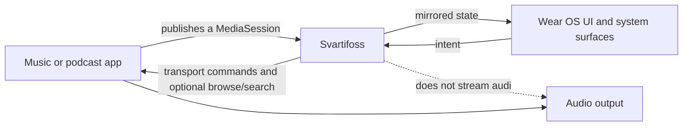

# Product Map

Svartifoss turns the watch into a configurable control surface for whatever is already playing on the phone. The product is best understood as a bridge between three worlds: Android media apps, a phone configuration/control plane, and a Wear OS interaction/presentation plane.

## Product notes

| Note | Main question |
| --- | --- |
| [Product overview](product-overview.md) | What problem does Svartifoss solve, and what are its boundaries? |
| [Feature map](feature-map.md) | What can users do on the watch and phone? |
| [User journeys](user-journeys.md) | How do setup, control, customization, discovery, and updates unfold? |
| [Trust, privacy, and distribution](trust-privacy-and-distribution.md) | What stays local, what can use the network, and how is the app shipped? |
| [History and direction](history-and-direction.md) | How did the product reach its current architecture, and what remains deliberately open? |

## Product principles visible in the code

- **Player-agnostic first.** Standard Android media contracts are the baseline; app-specific behavior is approached through safe fallbacks rather than account integrations.
- **The watch should feel immediate.** Commands use messages, local UI updates are optimistic where safe, and durable state follows behind.
- **Configuration belongs on the phone.** The larger screen owns complex editing, persistence, backup, and validation.
- **The wrist remains useful without opening the phone UI.** Physical buttons, gestures, Tiles, a complication, queue/search screens, and an on-watch face picker cover daily operation.
- **Customization is compositional.** Faces define layout; shared treatments define typography, color, artwork, panels, progress, and backgrounds.
- **Core use does not require an account.** Identity appears only around community participation; anonymous Firebase identity supports private reactions without visible sign-in.
- **Compatibility beats cleverness.** Stable IDs, additive protobuf fields, fallback parsing, and same-key APK signing preserve upgrades across independently updated devices.

## Product boundary

## Related maps

- [Home](../Home.md)
- [Architecture map](../02-architecture/architecture-map.md)
- [Codebase map](../03-codebase/codebase-map.md)

