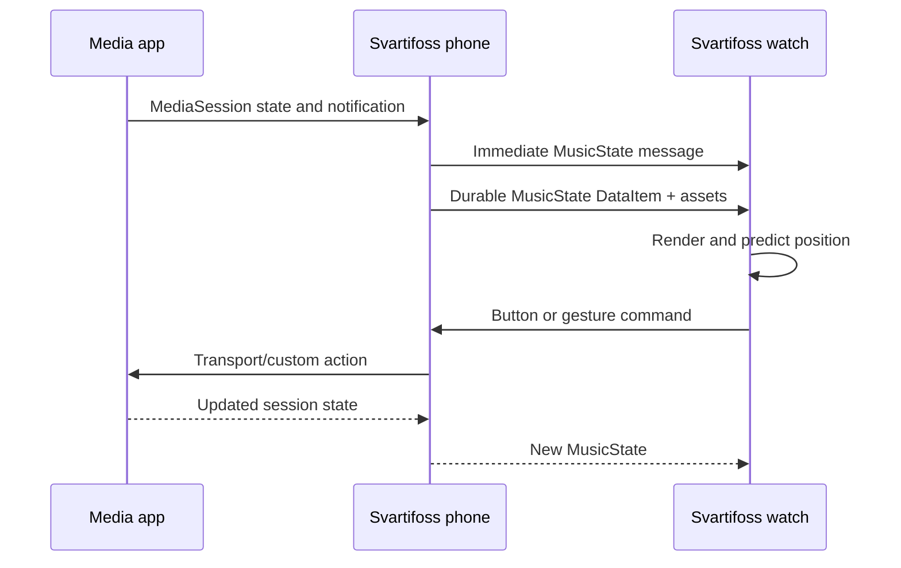

# User Journeys

## 1. First installation and connection

1. The user sideloads the phone and watch APKs from the same release.
2. Both APKs must have the same application ID and signing certificate for the Wearable Data Layer to connect them.
3. The phone asks the user to grant Android notification access. This is the practical gateway to seeing active media sessions and notification actions.
4. The watch reports its display geometry, physical buttons, app version, and supported hand-gesture state.
5. The phone publishes action configurations, settings, theme availability, and the current media state.

The phone shows the notification-access explanation once as a dialog and keeps a recoverable banner visible until access is granted.

## 2. Everyday playback control

The watch responds locally where safe, but the player's next reported state remains authoritative.

## 3. Configuring an input

1. On the phone, the user opens **Controls** and chooses either the playing or stopped state.
2. They select a physical button, quadrant, swipe, center tap, mini-button slot, quick-panel slot, rotary direction, or supported hand gesture.
3. The action picker displays categories and compatible actions.
4. The phone serializes the mapping, writes it to disk, and republishes the relevant DataItem.
5. A watch manifest listener updates the runtime configuration even when the main watch UI was idle.

The same `ButtonInfo → PhoneAction` model covers physical and pseudo inputs, which is why new action types become broadly assignable.

## 4. Designing and saving a look

1. The user opens the phone's **Watch** tab and selects a base face.
2. Contextual pages edit typography, colors, player chrome, panels, and background layers while the miniature shows the affected surface.
3. Values are written into the selected face's scope.
4. The process-wide preference coordinator sends one filtered snapshot over an immediate message and a durable DataItem.
5. The user can capture the current scoped appearance as a named local theme. Applying it materializes a complete snapshot into `custom_active`.

The watch can also pick a face. It applies the base layout locally for immediate feedback, sends the selection to the phone, and lets the authoritative snapshot return.

## 5. Opening a queue, library, or search result

- **Queue:** the phone finds the best queue-owning session, resolves covers concurrently, sends a cumulative page, and the watch opens near the active row.
- **No queue:** recent-track history is shown rather than pretending that a hidden queue can be reconstructed.
- **Library:** browsable IDs navigate to another page; playable IDs round-trip to the exact app that issued them.
- **Search:** voice/keyboard input happens on the watch; the phone searches the current media app and returns a custom list.

## 6. Starting a streaming shortcut

The watch asks the phone to play a saved service link. The phone tries, in order, a live session, a background media-browser path, and only then a visible deep-link open plus playback nudge. The watch waits for a verdict before opening the app on the phone, avoiding an unnecessary screen wake when silent playback already worked.

## 7. Browsing and installing a community theme

1. Opening the gallery fetches or reuses a cached static catalogue; normal browsing needs no account.
2. Filters and sorting operate locally over that catalogue.
3. The detail screen renders synthetic previews on the phone and may fetch the reviewed author photo when enabled.
4. **Add and apply** validates the public profile, installs a local copy with provenance, applies it, and records an install asynchronously without making the installation depend on analytics.
5. A heart tap creates or reuses a private anonymous Firebase identity and writes only that user's reaction document.

Submitting a theme is a separate author journey requiring linked Google identity and moderation. See [Community themes](../02-architecture/community-themes.md).

## 8. Updating

1. The phone checks GitHub Releases at a throttled interval when update checks are enabled.
2. Exact asset names identify `mobile-release.apk` and `wear-release.apk`.
3. The phone validates and installs its own APK through `PackageInstaller`.
4. For the watch, the phone downloads the APK, streams it over a Data Layer channel, and the watch validates the package before opening the system confirmation flow.

## Related notes

- [Product overview](product-overview.md)
- [Phone-watch communication](../02-architecture/phone-watch-communication.md)
- [Actions and input](../02-architecture/actions-and-input.md)
- [Releases and signing](../04-development/releases-and-signing.md)

