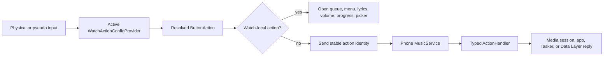

# Actions and Input

Svartifoss models almost every watch interaction as the same thing: a stable `ButtonInfo` identifying an input and gesture, mapped to a serialized `PhoneAction`. This lets one action catalogue serve physical buttons, touch regions, swipes, crown directions, mini buttons, quick-panel slots, center tap, and the supported hand gesture.

## Input namespace

| Codes | Input |
| --- | --- |
| `0–3` | left, top, right, and bottom screen quadrants |
| `4–6` | swipe up, down, and left |
| `7–9` | three visible mini-button slots |
| `10–13` | three quick-panel buttons plus the long row |
| `14` | center tap |
| `15` | primary one-handed gesture / double pinch |
| `10000–10001` | clockwise and counter-clockwise rotary pseudo buttons |

The rightward full-screen swipe is intentionally absent because left-to-right is Wear OS's universal dismiss gesture.

Physical buttons can support single tap, double tap, and long press. Visible mini buttons expose tap and long press but avoid double-tap latency. The hand gesture is one semantic primary action. Continuous rotary input can resolve to volume, seek, or off; devices with discrete rotary behavior can instead map directions like buttons.

## Configuration states

There are two complete button configurations:

- `/Actions/Playback` while music is playing or a track is active;
- `/Actions/Stopped` when no playback context exists.

This makes the same physical gesture context-sensitive. A button might skip a track while playing and launch a saved playlist while idle. Quick-panel assignments are copied into both configurations so that panel identity remains stable.

## Action catalogue

`RootActionList` assembles categories for:

- playback and seeking;
- volume;
- watch screens and UI;
- finding music through queue, search, history, library, or shortcuts;
- saved streaming shortcuts;
- Tasker, when installed.

Action classes live under `mobile/.../actions/`; handlers are bound in `di/ActionHandlersModule.kt`. Stable action class-name strings cross devices. Icons, user-facing titles, remote URI metadata, tintability, and cover-art identity are serialized as needed.

## Dispatch

`MusicViewModel.executeActionOnWatch` intercepts actions whose entire effect belongs on the wrist. Most others return to the phone because only it owns the media controller, Tasker, installed phone apps, or browser services.

## Gesture dispatch boundaries

The View-based `MainActivity` remains the owner of face-agnostic input. Compose content and Android child views can claim touch streams, so `ClaimedGestureHost` observes only streams a child truly claimed and forwards gesture information without stealing rejected events from the quadrant layout. A generic outer `OnTouchListener` would create dead zones over Compose.

Rotary events are suppressed while edge seeking is actively dragging, because Galaxy touch bezels report the same physical rim motion as rotary scroll.

## Hand-gesture availability

The watch probes platform/hardware/user-setting state and reports `UNSUPPORTED`, `DISABLED`, `READY`, or `UNKNOWN` through `WatchInfo`. The phone uses that report to explain the control instead of promising a row that cannot work. Codes are explicit, not enum ordinals, because the two APKs may update independently.

## Source anchors

- `common/.../buttonconfig/ButtonInfo.kt`
- `common/.../ScreenQuadrant.kt`, `SwipeGesture.kt`, `ScreenButtons.kt`, `QuickPanelButtons.kt`, `CenterButton.kt`, `DoublePinchGesture.kt`
- `mobile/.../actions/RootActionList.kt`
- `mobile/.../di/ActionHandlersModule.kt`
- `wear/.../config/WatchActionConfigProvider.kt`
- `wear/.../view/MainActivity.kt`
- `wear/.../input/DoublePinchGestureController.kt`

## Related notes

- [Feature map](../01-product/feature-map.md)
- [Mobile module](../03-codebase/mobile-module.md)
- [Wear module](../03-codebase/wear-module.md)
- [Change playbooks](../04-development/change-playbooks.md)

