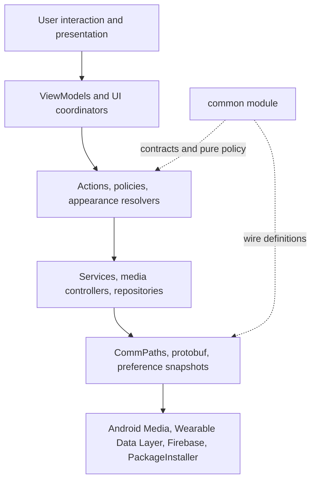

# Architecture Map

Svartifoss is a distributed Android application: two independently scheduled apps cooperate over an eventually connected transport. Its architecture follows from that fact more than from any single Android framework choice.

## Core notes

| Note | Responsibility |
| --- | --- |
| [System architecture](system-architecture.md) | Boundaries, authority, modules, and end-to-end topology |
| [Phone-watch communication](phone-watch-communication.md) | Data Layer transports, path families, ordering, and compatibility |
| [Playback and media sessions](playback-and-media-sessions.md) | Active-session selection, state mirroring, command execution, and position correction |
| [Actions and input](actions-and-input.md) | Unified physical/pseudo input model and action dispatch |
| [Preferences and state sync](preferences-and-state-sync.md) | Phone-owned settings, face scopes, dual delivery, and payload budgets |
| [Watch UI and appearance](watch-ui-and-appearance.md) | Face composition, shared treatments, preview parity, AOD, and secondary surfaces |
| [Content features](content-features.md) | Queue, search, library, shortcuts, lyrics, and metadata |
| [Runtime lifecycle and surfaces](runtime-lifecycle-and-surfaces.md) | Services, process wake-up, Tiles, complication, and shutdown |
| [Storage and caching](storage-and-caching.md) | Persistent files, preferences, transient caches, backups, and ownership |
| [Community themes](community-themes.md) | Local profiles, public catalogue, moderation, publication, and safety |

## Architectural layers

This is a conceptual layering rather than a rigid package architecture. The mature codebase mixes Views, Compose, services, and repositories, but ownership remains clear:

- `mobile` is the authority and action executor.
- `wear` is the interaction and wrist presentation client.
- `common` prevents semantic drift across the boundary.
- `wearutils` supplies cross-device Android utilities through a Git submodule.

## The four most important flows

1. **Media state:** player → phone media controller → `MusicService` → immediate message plus durable DataItem → `PhoneConnection` → watch UI and proxy session.
2. **User intent:** watch input → `ButtonInfo` → locally intercepted screen action or serialized command → `MusicService` → target media session/app.
3. **Configuration:** phone editor → local persistence → filtered snapshot/config DataItem → watch receiver/provider → rendered behavior.
4. **Community publication:** local profile → Firestore intake → moderation → trusted publisher → static GitHub Pages catalogue → validating client installer.

## Architectural style

The project uses several recurring patterns:

- durable truth plus a fast transient path;
- optimistic local response followed by authoritative convergence;
- pure, shared resolver functions around ambiguous fallback policy;
- schema and resource parity tests across module/language boundaries;
- process-scoped work for events that must outlive a closing screen;
- graceful degradation when a media app, permission, network, or newer field is absent.

## Related maps

- [Product map](../01-product/product-map.md)
- [Codebase map](../03-codebase/codebase-map.md)
- [Development map](../04-development/development-map.md)

