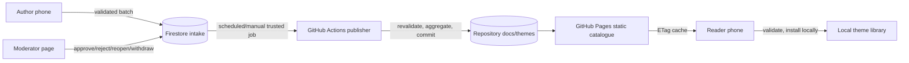

# Community Themes

Community themes extend the local, per-face appearance system without turning visual data into executable content or normal browsing into a live-backend cost.

## Local theme model

`WatchThemeRepository` stores up to 24 named profiles in a dedicated preference file. A profile captures a base face and the complete scoped appearance definition. Applying it materializes one complete `custom_active` snapshot into default preferences with ID, schema, completeness, and revision metadata.

An installed public profile retains `PublishedThemeSource` provenance. This lets the UI detect an existing installation or a later catalogue revision without overwriting local edits. Duplicating deliberately clears provenance and creates an independent user-owned fork.

Removing the active installed theme first applies its built-in base, then deletes it. Reversing that order would leave active metadata pointing at a missing snapshot.

## Split read/write architecture

Browsing and filtering read one static index and static profile files from GitHub Pages. Firebase is the private write plane for authors, reactions, installs, reports, moderation, and account deletion. A trusted publisher is the only component that turns approved intake into public Git data.

## Public profile boundary

A theme is typed, enumerated preference data. The strict public parser:

- accepts only current scoped appearance keys and exact JSON types;
- rejects unknown or archived base faces for new publication;
- enforces enumerated vocabularies, numeric ranges, and text limits;
- fills omitted values from shipped base-face defaults, not recipient preferences;
- rejects unsafe/oversized payloads;
- carries no arbitrary URI, path, intent, or code.

The constraints currently use schema 2 and include the ordered background-layer grammar. Four schema authorities must move together: Kotlin definitions, the shipped JSON asset, publisher JavaScript, and moderator-page JavaScript. Shared parity fixtures/tests detect drift.

`settingsDigest` is a canonical SHA-256 over the base face and sorted, type-tagged, length-prefixed values. Kotlin and Node must produce byte-identical encodings; it powers duplicate detection and originality checks.

## Identity and private ledgers

- **Browse/install:** no account required.
- **Like/unlike and Liked filter:** a missing Firebase identity is created anonymously without visible sign-in.
- **Install count:** a create-only private installer document is written after a successful install and never makes install success depend on the write.
- **Report:** a private, non-withdrawable reporter record; no public report tally.
- **Submit:** requires an identified account linked to Google, plus an author pseudonym or Anonymous public label.

Clearing app data can produce a new anonymous UID; likes are treated as a popularity signal rather than an audited ballot. Individual voter/installer/reporter lists are not public. Aggregated likes and installs update the static catalogue on the publisher's bounded refresh cadence.

## Intake and moderation

Submission writes an atomic group of intake, quota, account, and name-reservation documents. Current source policy requires at least 12 applicable visual changes and uses a fixed window of up to 10 submissions per 24 hours. Firestore's 1000-expression request limit shapes the rules: each document validates itself, while cross-document checks prove only pairing fields and request-time relationships.

Moderator identity lives in a separate review document because Firestore grants access per document, not per field. Moderators can decide, reopen, withdraw, and correct limited metadata; self-moderation restrictions apply to decisions/reopens, while urgent withdrawal remains possible.

Publication is a Git commit. The publisher re-parses and re-digests approved content, aggregates counts, updates the static catalogue and files, commits, and only then finalizes Firestore state. It also processes withdrawals and account-erasure requests.

## Screenshots

Public cards and most detail surfaces are rendered synthetically on the phone. One optional author photo of the Player may accompany a submission. The source is selected with the system picker, decoded and re-encoded to strip EXIF, constrained, stored only after intake succeeds, reviewed, and published under `docs/themes/shots/<id>-player.webp`.

Current shared contract: source width 128–512 px, output target width 450 px, WebP at most 96 KB, center crop, and no upscaling. The checked-in `CommunityThemeScreenshots.kt`, Firestore rules, publisher, and tests remain the authority.

## Infrastructure

- client: `mobile/.../view/watchface/theme/`
- safe shared policy: `common/.../CommunityThemeSubmissionPolicy.kt` and `CommunityThemeScreenshots.kt`
- constraints: `common/src/main/assets/community-theme-constraints.json`
- security boundary: `firestore.rules`
- emulator tests: `firebase/`
- moderator UI: `docs/admin/`
- trusted publisher: `.github/community-theme-publisher/`
- public catalogue: `docs/themes/`
- workflow: `.github/workflows/publish-community-themes.yml`

## Related notes

- [Trust, privacy, and distribution](../01-product/trust-privacy-and-distribution.md)
- [Storage and caching](storage-and-caching.md)
- [Testing strategy](../04-development/testing-strategy.md)
- [Source-of-truth matrix](../05-reference/source-of-truth-matrix.md)

