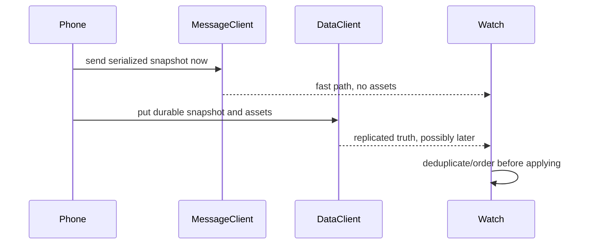

# Phone-Watch Communication

All application-level phone↔watch communication goes through Google Play Services' **Wearable Data Layer**. Path constants are centralized in `common/src/main/java/com/svartifoss/snfell/common/CommPaths.kt`; structured payloads use proto2 schemas under `common/src/main/proto/`.

## Transport roles

| Transport | Best for | Svartifoss examples |
| --- | --- | --- |
| `MessageClient` | immediate commands and transient replies | play/pause, seek, state fast path, lyrics, metadata, face choice |
| `DataClient` / DataItem | durable, replayable state and assets | music truth, settings, action configs, lists, watch info |
| Data Layer assets | larger binary data attached to a DataItem | album art, source icon, list thumbnails, button icons |
| `ChannelClient` | streamed payload | watch APK and diagnostic logs |

### Two transports, one payload

Music state and preference snapshots use both an immediate message and a durable DataItem:

The fast path prevents visible delay and stale playback prediction. The durable path survives sleep and process death, carries assets, establishes a fresh process's state, and owns preference removals. One is not a fallback replacement for the other.

For preferences, the message is attempted unconditionally before the DataItem put. Otherwise one permanently oversized or rejected DataItem could prevent the still-viable message from ever being sent.

## Path families

- `/Messages/*` is for a running connection: commands, state fast path, playback synchronization, lyrics, metadata, search, queue, and face selection.
- `/IdleMessages/*` is for phone→watch events that must wake an otherwise idle process, such as opening a surface, starting/stopping the app, or returning a deep-link verdict.
- `/PreferencesSync/Apply` has a dedicated manifest receiver for immediate settings.
- durable roots include `/Music/State`, `/Settings`, `/Actions/*`, `/ActionList`, `/CustomList/*`, `/WatchInfo`, and `/Notification`.
- `/Channel/Logs` and `/Channel/WearApk` carry streamed data.

See [Communication contracts](../05-reference/communication-contracts.md) for the exact index.

## Main endpoints

### Phone

- `WatchListenerService` is the manifest-reachable message ingress and forwards work to `MusicService`.
- `MusicService` handles most watch commands and publishes media/custom-list state.
- `WatchPreferenceSyncCoordinator` publishes settings.
- `ButtonConfigTransmitter` and `ActionListTransmitter` publish configuration.
- `WatchInfoProvider` reads the watch-authored `/WatchInfo` DataItem for phone UI and update decisions.

### Watch

- `PhoneConnection` is the runtime `DataClient`/`MessageClient` hub and exposes `LiveData` for UI consumers.
- `PreferencesReceiver` handles the durable `/Settings` snapshot.
- `PreferenceMessageReceiver` handles its immediate twin.
- `ConfigListenerService` wakes for action config/list DataItem changes.
- `MusicStateListenerService` wakes for media-state changes and refreshes system surfaces.
- `IdleMessageListener` handles wake-worthy commands.
- `WatchInfoSender` publishes the watch's capabilities back to the phone.

## Ordering and stale data

`MusicState.seq` is monotonic and allows the watch to discard old revisions replayed after reconnection. Preference messages carry their own sequence. Lyrics, metadata, and playback-sync responses echo the track identity, so a response that crossed a skip is rejected instead of appearing correct for the wrong song.

The message and DataItem version of `MusicState` may race. The watch accepts the first useful content, preserves assets when a fast state says artwork is still pending, and drops duplicate/stale content.

## Compatibility rules

- Keep path strings stable and centralized.
- Add optional protobuf fields; never renumber or reinterpret existing fields.
- Preserve legacy fields when independently updated phone/watch versions still need them.
- Encode stable semantic codes, not enum ordinals or localized labels.
- Do not move transient replies under `/IdleMessages/`; waking a process with no open consumer wastes work.
- Both APKs must keep the same application ID and signing key.

## Capacity

Data Layer items have an effective 100 KB ceiling. Binary assets are content-addressed and reused, but structured payloads still need limits. Music-state messages are capped before sending, queue pages are bounded, images are resized/compressed, and preference synchronization selects the active appearance scope rather than materializing every saved face.

## Source anchors

- `common/src/main/java/com/svartifoss/snfell/common/CommPaths.kt`
- `common/src/main/proto/*.proto`
- `mobile/src/main/java/com/svartifoss/snfell/WatchListenerService.kt`
- `wear/src/main/java/com/svartifoss/snfell/watch/communication/PhoneConnection.kt`
- both app manifests

## Related notes

- [Preferences and state sync](preferences-and-state-sync.md)
- [Playback and media sessions](playback-and-media-sessions.md)
- [Protobuf models](../05-reference/protobuf-models.md)
- [Same identity invariant](../04-development/architecture-invariants.md#1-one-application-identity)

