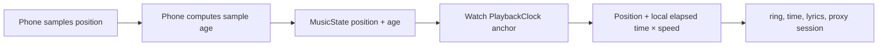

# Playback and Media Sessions

## Phone-side authority

`ActiveMediaSessionProvider` observes Android's active sessions. `MusicService` turns the chosen controller into a protobuf `MusicState`, publishes it to the watch, and executes commands against the appropriate phone-side target.

A single “current controller” is insufficient for every feature. Some apps expose multiple sessions: one may be actively playing while a sibling publishes the useful queue or browser catalog. Queue operations therefore preserve the controller that issued each queue ID.

When nothing is currently playing, Svartifoss can continue reporting the last live controller for a paused track. With no usable session at all, a play request may dispatch a global media-play key to resume the last media app.

## Watch-side mirror

`PhoneConnection` decodes state and exposes it to `MusicViewModel`. `WatchMusicService` owns a `WatchMediaSession`, a local `MediaSessionCompat` proxy that:

- mirrors metadata, playback state, artwork, and volume;
- makes phone playback visible to Wear OS system media UI;
- forwards play/pause, next/previous, seek, and volume intent back across the Data Layer.

The proxy is not a second playback authority. The media app on the phone remains the source of truth.

## State publication

State text and controls need low latency; artwork may arrive later. The phone therefore sends a message fast path without assets and a durable DataItem with album/source assets. `albumArtPending` tells the watch not to blank the previous cover merely because the new cover is still crossing Bluetooth.

Position-only changes are intentionally suppressed. Sending a packet every second would turn predictable time into constant radio traffic. The watch extrapolates instead.

## Playback position model

> [!important] Never compare phone and watch clocks
> `positionAgeMs` is a duration computed on the phone. The watch adds time measured by its own monotonic clock. No wall-clock timestamp is subtracted across devices.

`PlaybackClock` is the single watch anchor shared by the player, lyrics, and media-session proxy. Local seek and optimistic play/pause events re-anchor it immediately.

### Round-trip correction

The watch periodically sends its own monotonic token in `MESSAGE_REQUEST_PLAYBACK_SYNC`; the phone echoes it with a fresh `PlaybackSync`. The watch measures round-trip time using only its clock and estimates one-way transport cost as half the RTT.

`PlaybackSyncPolicy` rejects very slow samples, ignores tiny drift, eases moderate drift, snaps large drift, and backs off checks that find nothing to correct. Current policy thresholds are tested in `common/src/test/.../PlaybackSyncPolicyTest.kt`; treat the test and source as the authority if values change.

## Track-boundary prediction

When the watch already holds a credible ordered queue and the current duration elapses, `PredictedTrackAdvance` may show the next entry before the phone's delayed state/artwork arrives. It refuses to predict under shuffle, repeat-one, implausible duration, or ambiguous queue state. Any real `MusicState` replaces the prediction immediately.

## Commands versus capabilities

Media-session capability bitmasks are hints, not reliable contracts. Svartifoss distinguishes between:

- commands whose unsupported result is a safe no-op—often issue them and verify;
- commands with a real alternative—capability information may guide fallback selection;
- opaque notification actions—execute only by the phone-local registry ID that owns the original `PendingIntent`.

Queue selection is the worked example: issue `skipToQueueItem` to the queue-owning controller even if its advertised bit is absent, observe whether playback identity changes, and fall back to a browser media ID when available.

## Source anchors

- `mobile/src/main/java/com/svartifoss/snfell/music/ActiveMediaSessionProvider.kt`
- `mobile/src/main/java/com/svartifoss/snfell/music/MusicService.kt`
- `wear/src/main/java/com/svartifoss/snfell/watch/communication/PlaybackClock.kt`
- `wear/src/main/java/com/svartifoss/snfell/watch/communication/WatchMediaSession.kt`
- `common/src/main/java/com/svartifoss/snfell/common/PlaybackPositionEstimate.kt`
- `common/src/main/java/com/svartifoss/snfell/common/PlaybackSyncPolicy.kt`

## Related notes

- [Content features](content-features.md)
- [Phone-watch communication](phone-watch-communication.md)
- [External integrations](../05-reference/external-integrations.md)

