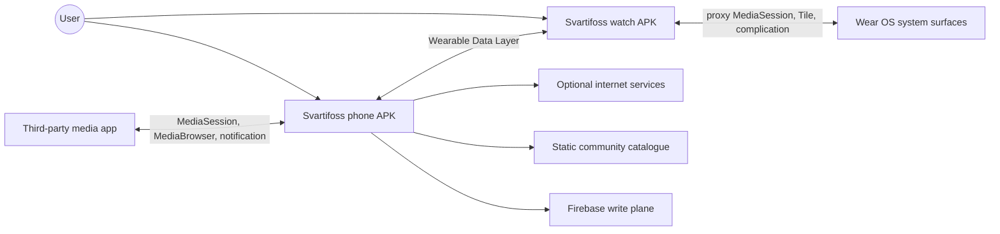

# System Architecture

## Context

## Responsibility split

| Concern | Phone | Watch | Shared core |
| --- | --- | --- | --- |
| Discover and control media sessions | authority | forwards intent | shared action identifiers |
| Persistent configuration | authority | cached consumer | typed preference definitions and scope rules |
| User input | configuration UI | capture and dispatch | stable input codes and gestures |
| Now-playing presentation | miniature preview | real renderer | palette, geometry, typography, and fallback policy |
| Network access | owns application requests | normally none | request/response models |
| Update installation | downloads/installs phone; streams watch APK | validates/installs watch | channel path |
| Community gallery | catalogue, identity, install, submit | no direct role | safe profile policy |
| System media integration | source observation | proxy session and glanceable surfaces | `MusicState` schema |

The split is asymmetric by design. A Bluetooth-only watch may have no independent internet path; Android restricts background activity starts on the phone; only the phone has notification access and the full configuration surface; only the watch knows its hardware controls and round-display geometry.

## Modules

- `mobile/` is an Android application using Dagger 2 and predominantly Views/AppCompat.
- `wear/` is an Android application using Hilt, a View-based now-playing host, and Compose for newer faces and secondary screens.
- `common/` is an Android library compiled into both applications. It owns protocol paths, generated protobuf classes, shared resources, model identifiers, and deterministic policy.
- `wearutils/` is a Git submodule and library used by the other modules for Wear-specific utilities.

`mobile` and `wear` do not depend on each other. Anything that must be identical across them must move into `common` or be guarded by a cross-source parity test.

## Authority and convergence

Persistent choices belong to the phone. This solves a fundamental distributed-state problem: a watch can sleep, reboot, be replaced, or be offline while the user edits settings. The phone keeps one recoverable source of truth and re-publishes it when processes reconnect.

The watch still performs selected actions immediately:

- it opens local screens without a round trip;
- it updates the playback clock immediately after seek/play/pause intent;
- it locally applies the base face selected in the wrist picker;
- it can predict the next queue entry at a credible track boundary.

Those are projections or predictions, never independent persistent authorities. Real state replaces them when it arrives.

## Failure model

The design assumes all of the following can happen:

- messages can be lost;
- DataItems can arrive late or replay buffered revisions;
- the two app versions can differ;
- either process can die between steps;
- a watch can be asleep when the phone changes configuration;
- a media app can lie through capability flags or expose several sessions;
- a lifecycle-bound coroutine can be cancelled as its screen closes;
- persisted bundles or preferences can come from older app/OS versions.

Consequently, the system uses monotonic sequences, idempotent writes, manifest listeners, defensive parsing, bounded retries, durable caches, and explicit fallbacks.

## Source anchors

- `settings.gradle`
- `mobile/src/main/AndroidManifest.xml`
- `wear/src/main/AndroidManifest.xml`
- `common/src/main/java/com/svartifoss/snfell/common/CommPaths.kt`
- `mobile/src/main/java/com/svartifoss/snfell/music/MusicService.kt`
- `wear/src/main/java/com/svartifoss/snfell/watch/communication/PhoneConnection.kt`
- `wear/src/main/java/com/svartifoss/snfell/watch/communication/WatchMusicService.kt`

## Related notes

- [Phone-watch communication](phone-watch-communication.md)
- [Repository map](../03-codebase/repository-map.md)
- [Architecture invariants](../04-development/architecture-invariants.md)

