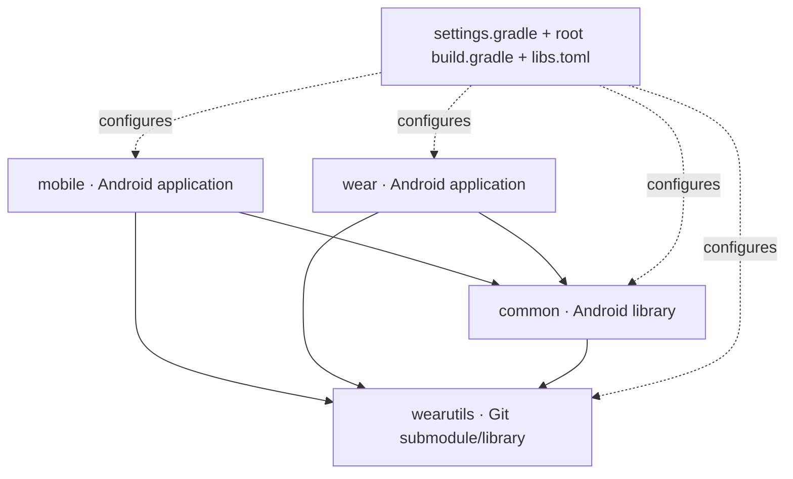

# Codebase Map

## Notes

| Note | What it maps |
| --- | --- |
| [Repository map](repository-map.md) | Root directories, build inputs, infrastructure, references, and generated output |
| [Mobile module](mobile-module.md) | Phone application packages, Dagger graph, UI, services, actions, storage, and updates |
| [Wear module](wear-module.md) | Watch application packages, Hilt graph, UI stack, communication, inputs, and system surfaces |
| [Common and WearUtils](common-and-wearutils.md) | Shared policy, resources, protobuf generation, and submodule boundary |
| [Entry points](entry-points.md) | Android components and the first file to inspect for common runtime events |

## Dependency graph

`mobile` and `wear` deliberately have no dependency on each other. Cross-device agreements belong in `common`, or—when rendering APIs make sharing impossible—are checked by structural tests.

## Package roots

| Module | Source package | Important naming detail |
| --- | --- | --- |
| `mobile` | `com.svartifoss.snfell.*` | there is no `.mobile` package segment |
| `wear` | `com.svartifoss.snfell.watch.*` | code lives under `.watch`, even though the module is named `wear` |
| `common` | `com.svartifoss.snfell.common.*` | generated protobuf uses sibling package `com.svartifoss.snfell.proto` |
| `wearutils` | `com.matejdro.wearutils.*` | upstream-compatible package names are retained |

One working AIDL interoperability surface under `mobile` intentionally retains `com.matejdro.wearvibrationcenter.notificationprovider`. Do not mechanically rename it.

## Fast routes into the code

- Media state or playback command: `mobile/.../music/MusicService.kt`
- Watch transport/state: `wear/.../communication/PhoneConnection.kt`
- Watch screen behavior: `wear/.../view/MusicViewModel.kt` and `MainActivity.kt`
- Phone shell/navigation: `mobile/.../view/mainactivity/MainActivity.kt`
- Watch-facing preference contract: `common/.../MiscPreferences.kt`
- Per-face appearance behavior: `common/.../FaceScopedPreferences.kt`
- Data Layer path: `common/.../CommPaths.kt`
- Wire field: `common/src/main/proto/`
- Public theme policy: `mobile/.../view/watchface/theme/` plus the shared constraints and publisher/rules mirrors

## Related maps

- [Architecture map](../02-architecture/architecture-map.md)
- [Development map](../04-development/development-map.md)
- [Reference map](../05-reference/reference-map.md)

