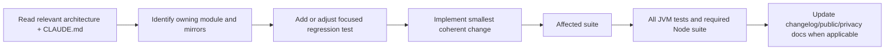

# Development Map

## Contributor notes

| Note | Use it for |
| --- | --- |
| [Getting started](getting-started.md) | prerequisites, repository setup, builds, and local installation |
| [Testing strategy](testing-strategy.md) | selecting tests, structural contracts, Node suites, and lint limitations |
| [Architecture invariants](architecture-invariants.md) | rules whose violation usually fails silently across devices |
| [Change playbooks](change-playbooks.md) | checklists for actions, preferences, faces, schemas, languages, caches, and network behavior |
| [Localization](localization.md) | locale application, resource folders, picker arrays, and translation verification |
| [Observability and debugging](observability-and-debugging.md) | logs, Crashlytics, symptom-oriented diagnosis, and device boundaries |
| [Releases and signing](releases-and-signing.md) | versioning, release assets, shared certificate, and built-in updater contract |
| [Documentation maintenance](documentation-maintenance.md) | keeping this vault and public project copy accurate |

## Normal workflow

## Engineering values encoded in the repository

- Prefer a small pure resolver when the difficult part is a fallback decision.
- Test structural contracts by reading registries/resources when no single function owns them.
- Keep phone and watch compatibility additive.
- Preserve user data and unrelated working-tree edits.
- Verify on the narrowest owning module first, then widen.
- Treat explanations in `CLAUDE.md` as design constraints, especially around communication, preferences, playback, and watch UI.

## Related maps

- [Architecture map](../02-architecture/architecture-map.md)
- [Codebase map](../03-codebase/codebase-map.md)
- [Reference map](../05-reference/reference-map.md)

