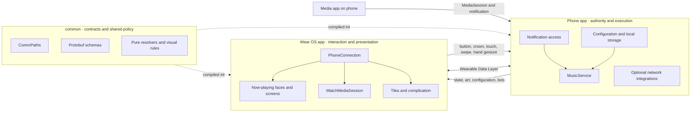

# Svartifoss

> [!abstract] The one-sentence model
> Svartifoss is a two-device Android system in which the **phone owns media access, actions, settings, persistence, and internet work**, while the **Wear OS app owns wrist input, presentation, and system surfaces**; a shared module keeps their protocol and deterministic decisions aligned.

## The map

| Start here | Use it when you want to understand… |
| --- | --- |
| [Product map](01-product/product-map.md) | the user problem, capabilities, journeys, trust model, and product history |
| [Architecture map](02-architecture/architecture-map.md) | runtime flows, synchronization, playback, actions, appearance, and community themes |
| [Codebase map](03-codebase/codebase-map.md) | modules, packages, entry points, and repository layout |
| [Development map](04-development/development-map.md) | setup, tests, invariants, change recipes, localization, and releases |
| [Reference map](05-reference/reference-map.md) | exact Data Layer paths, protobuf messages, preference domains, and sources of truth |

Open [Svartifoss.canvas](Svartifoss.canvas) for the spatial version of this map.

## System at a glance

## What Svartifoss is—and is not

Svartifoss is a media-session companion. It observes the active Android media session, mirrors useful state to the wrist, and sends user intent back to the phone. It is designed around optional platform contracts: every player exposes a different subset of queue, search, custom actions, metadata, and browsing behavior.

It is **not** a music player, streaming service, or audio transport. It does not own the user's library or stream audio between devices. Its “faces” are in-app now-playing layouts, not installable system watch faces. Core phone-to-watch control needs no Svartifoss account and normally stays on the local Wearable Data Layer connection.

## Architectural center of gravity

- The phone's `MusicService` is the runtime hub for media state and action execution.
- The watch's `PhoneConnection` is the Data Layer hub; `MusicViewModel` turns its state into UI behavior.
- `WatchMusicService` owns the watch-side proxy media session and keeps the connection alive when needed.
- `common` defines transport paths, protobuf schemas, shared preference contracts, input identifiers, and pure policies used by both apps.
- Configuration is phone-owned. The watch may apply selected changes optimistically, but it reports them back so the phone remains authoritative.

Read [System architecture](02-architecture/system-architecture.md) for the full model.

## Current public shape

| Property | Current source-tree value |
| --- | --- |
| Platforms | Android phone and Wear OS watch |
| Distribution | Sideloaded APKs from GitHub Releases; built-in updater after initial install |
| Application ID | `com.svartifoss.snfell` on both APKs |
| Phone SDK range | minimum 23, target 36 |
| Watch SDK range | minimum 26, target 35; compiled against API 36.1 |
| Shared library minimum | API 21 |
| Language | Kotlin with some Java, Groovy Gradle DSL, proto2 schemas |
| Dependency injection | Dagger 2 on phone; Hilt on watch |
| UI | Views/AppCompat on phone; mixed legacy Views and Compose on watch |
| License | GPL-3.0 |

## Suggested reading paths

- **New user or writer:** [Product overview](01-product/product-overview.md) → [Feature map](01-product/feature-map.md) → [User journeys](01-product/user-journeys.md)
- **New contributor:** [System architecture](02-architecture/system-architecture.md) → [Repository map](03-codebase/repository-map.md) → [Getting started](04-development/getting-started.md)
- **Changing phone/watch behavior:** [Phone-watch communication](02-architecture/phone-watch-communication.md) → [Architecture invariants](04-development/architecture-invariants.md) → [Change playbooks](04-development/change-playbooks.md)
- **Working on appearance or themes:** [Watch UI and appearance](02-architecture/watch-ui-and-appearance.md) → [Preferences and state sync](02-architecture/preferences-and-state-sync.md) → [Community themes](02-architecture/community-themes.md)
- **Investigating a bug:** [Entry points](03-codebase/entry-points.md) → [Observability and debugging](04-development/observability-and-debugging.md) → [Source-of-truth matrix](05-reference/source-of-truth-matrix.md)

## First principles

1. The two apps are one distributed product, but they run in separate processes on separate devices.
2. The phone is the authority for state that must survive reconnection.
3. Durable DataItems and immediate messages solve different delivery problems and are often used together.
4. Media-player capabilities are unreliable hints; safe no-op commands are often issued and verified.
5. Shared deterministic logic belongs in `common`, especially when phone preview and watch rendering must agree.
6. Backward compatibility matters at every persisted key, protobuf field, action identifier, and release signature.

